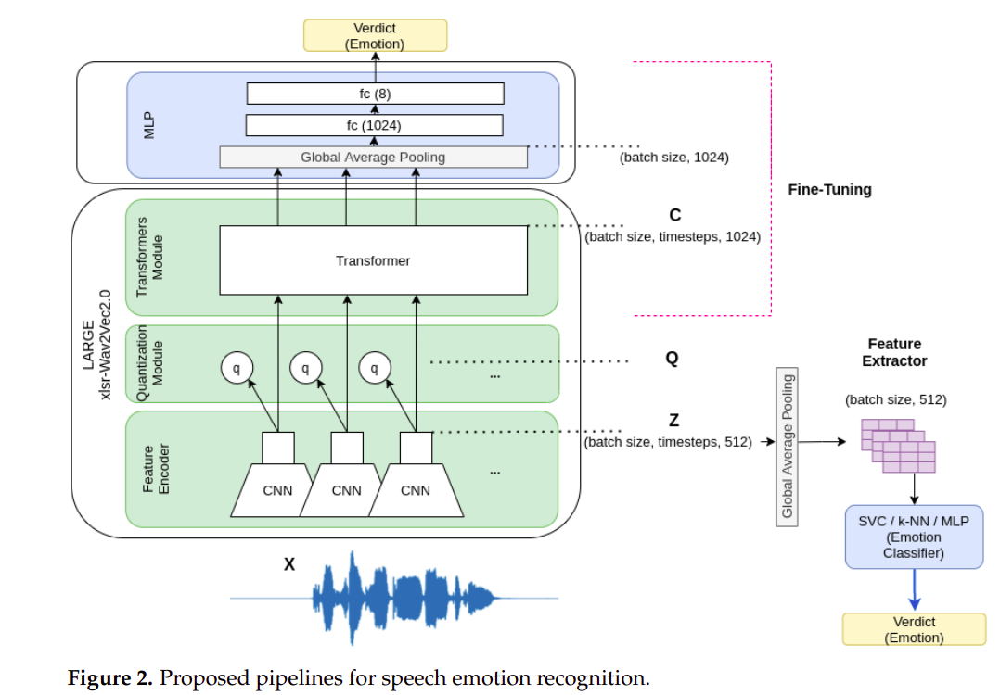

# MMEmotionRecognition
Repository with the code of the paper: [A proposal for Multimodal Emotion Recognition using aural transformers and Action Units on RAVDESS dataset](https://www.mdpi.com/2076-3417/12/1/327)

## Installation

To install the python packages, create a new virtual environment and run:

    pip install git+https://github.com/huggingface/datasets.git
    pip install git+https://github.com/huggingface/transformers.git
    pip install -r requirements.txt

** If problems installing certain libraries, try to update your pip version: pip3 install --upgrade pip
and run again the previous command

## Download datasets
For reproducing the experiments, firt you need to download the dataset used for the experiments: 

- [x] [RAVDESS](https://zenodo.org/record/1188976#.YFZuJ0j7SL8)

Once downloaded, put them in your working directory, in what follows, we will refer to these directories as: 

* \<RAVDESS_dir> : Root Directory where we downloaded RAVDESS dataset

## Prepare dataset (5 CV)
For evaluating our models, we used a subject-wise 5CV. The distribution per actor for the validation folds was as follows:

* Fold 0: (2, 5, 14, 15, 16);
* Fold 1: (3, 6, 7, 13, 18);
* Fold 2: (10, 11, 12, 19, 20);
* Fold 3: (8, 17, 21, 23, 24);
* Fold 4: (1, 4, 9, 22).

## Speech Emotion Recognition:

### Pre-processing
To extract the audios from the videos and change their format to 16kHz & single channel, run: 
    
    python3 MMEmotionRecognition/src/Audio/FineTuningWav2Vec/process_audio.py
             --videos_dir <RAVDESS_dir>/videos
             --out_dir <RAVDESS_dir>/audios_16kHz

### Fine-Tuning

#### Training
To fine-tune the xlsr-Wav2Vec2.0 model, run: 

    python3 MMEmotionRecognition/src/Audio/FineTuningWav2Vec/main_FineTuneWav2Vec_CV.py 
    --audios_dir <RAVDESS_dir>/audios_16kHz --cache_dir MMEmotionRecognition/data/Audio/cache_dir 
    --out_dir <RAVDESS_dir>/FineTuningWav2Vec2_out
    --model_id jonatasgrosman/wav2vec2-large-xlsr-53-english

After finishing the fine-tuning process, the datasets and the trained models will be saved in the folder <RAVDESS_dir>/FineTuningWav2Vec2_out

#### Evaluation
To evaluate and get some metrics of the trained model, you should run the Wav2Vec2.0 script, as in the example below. Notice that you should modify
the dict of line 119 (checkpoints_per_fold) to the top models in case you changed the seed or used the code for other tasks. 
 
    python3 MMEmotionRecognition/src/Audio/FineTuningWav2Vec/Wav2VecEval.py
             --data <RAVDESS_dir>/FineTuningWav2Vec2_out/data/YYYYMMDD_HHMMSS
             --fold 0
             --trained_model <RAVDESS_dir>/FineTuningWav2Vec2_out/trained_models/wav2vec2-xlsr-ravdess-speech-emotion-recognition/YYYYMMDD_HHMMSS
             --out_dir <RAVDESS_dir>/FineTuningWav2Vec2_posteriors
             --model_id jonatasgrosman/wav2vec2-large-xlsr-53-english

To evaluate our models and generate the posteriors, the code to execute would be the following:

    python3 MMEmotionRecognition/src/Audio/FineTuningWav2Vec/Wav2VecEval.py
             --data MMEmotionRecognition/data/models/wav2Vec_top_models/FineTuning/data/20211020_094500
             --fold 0
             --trained_model MMEmotionRecognition/data/models/wav2Vec_top_models/FineTuning/trained_models/wav2vec2-xlsr-ravdess-speech-emotion-recognition/20211020_094500
             --out_dir <RAVDESS_dir>/FineTuningWav2Vec2_posteriors
             --model_id jonatasgrosman/wav2vec2-large-xlsr-53-english

Notice that for the evaluation, you will get the metrics per fold, so for obtaining the final average accuracy, you should have run the previous command changing the fold to 0, 1, 2, 3, and 4. 
After running the precious command 5 times, we will run the following script to obtain the final accuracy (plotted on the console): 

     python3 MMEmotionRecognition/src/Audio/FineTuningWav2Vec/FinalEvaluation.py
             --dataPosteriors MMEmotionRecognition/data/models/wav2Vec_top_models/FineTuning/posteriors/20211020_094500
             --trained_model MMEmotionRecognition/data/models/wav2Vec_top_models/FineTuning/trained_models/wav2vec2-xlsr-ravdess-speech-emotion-recognition/20211020_094500
		

### Feature Extraction from xlsr-Wav2Vec2.0

To extract the features, first, we need to run the fine-tuning section to generate the train.csv and test.csv files. After running previous section, we could extract the features from the generated files, running the following command:

    ...

## Facial Emotion Recognition:
### Pre-processing
## FAQ

### License:
MIT License

### Citation
If you use the code of this work or the generated models, please cite the following paper:

####IEEE format:
C. Luna-Jiménez, R. Kleinlein, D. Griol, Z. Callejas, J. M. Montero, and F. Fernández-Martínez, “A Proposal for Multimodal Emotion Recognition Using Aural Transformers and Action Units on RAVDESS Dataset,” Applied Sciences, vol. 12, no. 1, p. 327, Dec. 2021.

(You can find more citation formats in the [MDPI page](https://www.mdpi.com/2076-3417/12/1/327))
### Acknowledgment 
We would like to thank to [m3hrdadfi](https://github.com/m3hrdadfi) for his open tutorial on [Speech Emotion Recognition (Wav2Vec 2.0)](https://github.com/m3hrdadfi/soxan) that we used as base to
train our speech emotion recognition models on RAVDESS dataset
